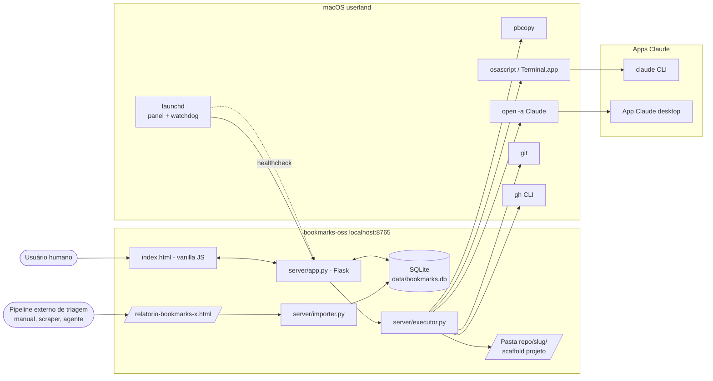
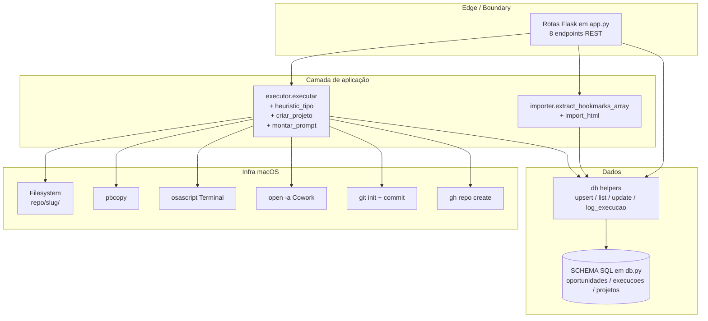

# DESIGN — bookmarks-oss

> Visão de arquitetura. Decisões pontuais ficam em ADRs (`./ADR-*.md`).
> Audiência: dev humano e agent AI editando o painel. Sessões dentro de pastas geradas pelo **+ New project** seguem o `CLAUDE.md` daquela pasta, não este.

---

## 1. Contexto de sistema

Quem fala com quem. Tudo roda em `127.0.0.1` na máquina do usuário; nada sai dessa máquina.

Notas:
- O HTML curado é **input externo**. Como ele nasce não é problema do painel.
- `flask` é o único caminho de leitura/escrita no `db`.
- `executor` só dispara processos macOS (não fala HTTP com terceiros). Tokens do `gh` ficam no Keychain.
- `launchd` mantém o painel sempre vivo (`KeepAlive`, `Crashed`, `NetworkState`) e o watchdog dá `kickstart -k` se `/api/healthz` falhar.

---

## 2. Componentes (zoom)

Princípio: `db.py` é a única abstração de persistência. `app.py` chama helpers; nunca constrói SQL inline. `executor.py` orquestra side effects e registra resultado via `db.log_execucao` + `db.update_oportunidade`.

---

## 3. Boundaries

| Boundary | Responsabilidade | Regra |
|---|---|---|
| Edge (`server/app.py`) | Receber HTTP, parsear JSON, mapear status code, retornar 4xx para input ruim | Sem SQL inline. Sem chamar `pbcopy` direto. Só orquestra. |
| Aplicação (`importer.py`, `executor.py`) | Lógica de import e despacho | Stateless; recebe parâmetros já tipados; loga via `print` (capturado pelo launchd em `data/panel.{out,err}.log`) |
| Dados (`server/db.py`) | SCHEMA, helpers, conexão sqlite3 | Nada de Flask aqui. Aceita parâmetros, devolve `sqlite3.Row` ou dict. |
| Infra (macOS userland) | `pbcopy`, `osascript`, `open -a`, `git`, `gh` | Chamada via `subprocess`. Falha de processo opcional não derruba a request — loga e segue. |
| UI (`index.html`) | Vanilla JS, sem framework | Só fetch para `/api/*`. Estado em `state` no escopo do módulo. |

Cruzar boundary errado = code smell. Exemplo: `index.html` falando direto com SQLite via WebView é vermelho.

---

## 4. Stack

| Camada | Tecnologia |
|---|---|
| Linguagem backend | Python 3.11+ |
| Framework HTTP | Flask 3.0+ (única dep do hot path) |
| Persistência | SQLite via `sqlite3` stdlib |
| Frontend | HTML + CSS + vanilla JS (sem build, sem bundler) |
| Runtime | macOS (`launchctl`, `pbcopy`, `osascript`, `open -a`) |
| Deps opcionais | `claude` CLI (Anthropic), `gh` CLI, app desktop Claude |
| Testes | TODO: humano definir (sem suíte de teste hoje) |
| CI | GitHub Actions (`.github/workflows/`) — TODO: pipeline real |
| Observabilidade | `print()` capturado pelo launchd em `data/panel.{out,err}.log`; healthcheck em `data/healthcheck.log` |

Mudou stack? Abre ADR. Adicionar dep nova passa por confirmação humana (regra hard de `AGENTS.md`).

---

## 5. Decisões principais

Resumo. Detalhe em ADRs.

- [ADR-001](./ADR-001-example.md) — placeholder (atualizar/substituir conforme decisão real).
- TODO: ADR sobre **bind em `127.0.0.1` sem auth** (decisão atual = risco aceito porque single-user local-first).
- TODO: ADR sobre **schema pt-BR vs identifiers em inglês** (compat com SQLite existente).
- TODO: ADR sobre **launchd como única estratégia always-on** (não cron, não systemd).

Toda decisão que afeta mais de um componente vira ADR.

---

## 6. Fluxo de uma request — `POST /api/oportunidades/<id>/executar`

Caminho real, ponta-a-ponta:

1. UI (`index.html`) faz `fetch('/api/oportunidades/<id>/executar', {method:'POST', body:JSON.stringify({tipo, criar_projeto, com_github})})`.
2. Flask (`app.py:api_executar`, linha 93) lê o body, chama `executor.executar(op_id, tipo, criar_projeto, com_github)`.
3. `executor.executar` carrega a oportunidade via `db.get_oportunidade`.
4. Se `tipo` é `auto`/None: roda `heuristic_tipo(op)` (`executor.py:65-82`) — keywords + categoria classificam entre `claude_code` e `cowork`.
5. Se `criar_projeto=True`: `criar_projeto(op)` cria pasta `<repo>/<slug>/`, escreve `README.md` + `CLAUDE.md`, roda `git init` + commit; com `com_github=True`, dispara `gh repo create --private`.
6. `montar_prompt(op, tipo, projeto_path)` monta o texto a colar (i18n via `PROMPT_I18N`).
7. `pbcopy` copia o prompt para o clipboard.
8. Se `tipo='claude_code'`: `osascript` abre Terminal na pasta e executa `claude "<prompt>"`. Se `tipo='cowork'`: `open -a "$COWORK_APP"`.
9. `db.log_execucao(op_id, tipo, prompt, projeto_path)` insere linha em `execucoes` com `status='iniciada'`.
10. `db.update_oportunidade(op_id, status='em_progresso')`.
11. Flask retorna `200` com `{ok: true, tipo, projeto_path}` ou erro estruturado.

Falhou no passo 3 (oportunidade inexistente)? Retorna `404` antes de tocar o filesystem. Falhou no passo 5 (`gh` não autenticado)? Loga e segue — projeto fica sem `github_url` mas a execução não é abortada.

---

## 7. Não-objetivos

- **Não suportar Linux/Windows** hoje (depende de `launchctl` + `pbcopy` + AppleScript).
- **Não acoplar a um único modelo de IA**: o painel só copia o prompt no clipboard e abre app/CLI. Quem responde é Claude Code ou Cowork.
- **Não virar gestor de tarefas multi-usuário**: `127.0.0.1`, sem auth, sem RBAC.
- **Não gerar código no painel**: o painel apenas dispara. Quem escreve é o agente que abre.

---

## 8. Observabilidade

- Logs do painel: `data/panel.out.log` + `data/panel.err.log` (capturados pelo launchd via `panel.plist.template`).
- Logs do watchdog: `data/healthcheck.log` (escrito por `healthcheck.sh` a cada 5 min).
- Endpoint de saúde: `GET /api/healthz` retorna `{ok:true}` + contadores básicos.
- `db.stats()` agrega contagem por `status` para a métrica de adoção.
- Sem PII no log: o conteúdo dos bookmarks pode incluir handles e URLs — manter no log apenas IDs e contadores.

---

## 9. Como evoluir este documento

- Mudança pequena (typo, ajustar diagrama existente): PR direto.
- Mudança estrutural (novo componente, novo boundary, mudar runtime): abre ADR primeiro, depois atualiza este arquivo.
- Renomear conceito de domínio: atualiza `.specs/product/DOMAIN.md` no mesmo PR.
- Adicionar dependência: confirmação humana antes — vira ADR se vai pro hot path.

---

## Histórico

| Data | Versão | Mudança | Quem |
|---|---|---|---|
| 2026-05-07 | 0.1 | Criação inicial — diagramas refletem `server/{app,db,executor,importer}.py` real | Wesley Simplicio |
