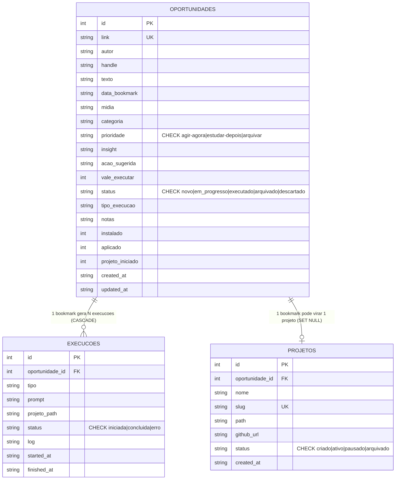
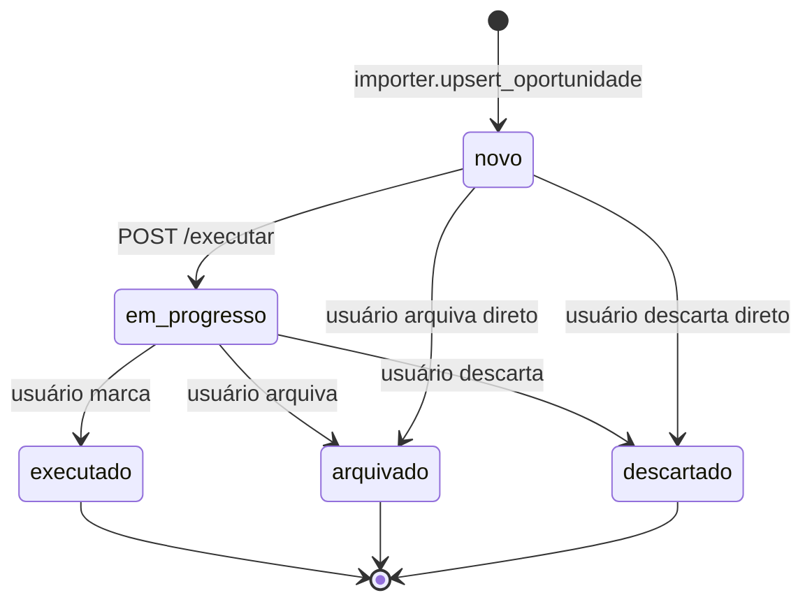

# DOMAIN — bookmarks-oss

Glossário e modelo de entidades. Quando um termo aparecer no código (variável, classe, endpoint, schema), ele tem que estar aqui antes. Toda entidade abaixo corresponde 1:1 a uma tabela ou campo real em `server/db.py:22-86`.

> Regra: vocabulário pt-BR no schema e payload (compat). Função/var/classe em inglês quando puder. Se um termo já vive no DB com nome pt-BR, mantém — renomear é breaking change.

---

## Glossário

Ordem alfabética. Uma linha por termo. Cada termo aparece em pelo menos um arquivo do repo.

| Termo | Definição | Onde aparece |
|---|---|---|
| `acao_sugerida` | Frase curta sobre o que fazer com o bookmark; alimenta o prompt despachado para Claude/Cowork. | `server/db.py:34`, `executor.py:montar_prompt`, `index.html` |
| `aplicado` | Flag 0/1: marca que o usuário já colocou em prática o que o bookmark sugeria. Independente de `instalado`. | `server/db.py:41`, `app.py:api_update`, `index.html` |
| `categoria` | Tag livre vinda do HTML curado (ex.: "Claude Code", "MCP", "Prompt"). Entrada da heurística. | `server/db.py:31`, `executor.py:CODE_CATEGORIES`/`DESKTOP_CATEGORIES` |
| `Cowork` | Apelido interno para o app desktop oficial Claude (Anthropic). Configurável via env `COWORK_APP`. | `executor.py:open_app`, `.env.example`, README |
| `execucao` | Registro imutável de um clique no botão **Execute**: tipo, prompt enviado, projeto associado, status final. | tabela `execucoes` (`db.py:51-65`) |
| `instalado` | Flag 0/1: dependência mencionada no bookmark já está instalada na máquina. | `server/db.py:40`, `index.html` |
| `oportunidade` | Bookmark importado, identificado por `link` único; agregado raiz do domínio. | tabela `oportunidades` (`db.py:23-46`) |
| `prioridade` | Veredicto de triagem: `agir-agora`, `estudar-depois`, `arquivar`. Sai do HTML, editável no painel. | `server/db.py:32`, CHECK constraint |
| `projeto` | Pasta scaffold em `<repo>/<slug>/` criada por **+ New project**, com README/CLAUDE.md, `git init`, opcional `gh repo create`. | tabela `projetos` (`db.py:67-78`), `executor.py:criar_projeto` |
| `projeto_iniciado` | Flag 0/1: já existe pasta scaffold para essa oportunidade. | `server/db.py:42`, `index.html` |
| `slug` | Identificador único, kebab-case derivado de `texto`/`acao_sugerida`; nome de pasta e chave em `projetos`. | `executor.py:slugify`/`gerar_slug_para`, `db.py:71` UNIQUE |
| `status` (oportunidade) | Estado: `novo` → `em_progresso` → `executado`/`arquivado`/`descartado`. | `server/db.py:36-37` CHECK |
| `status` (execucao) | Resultado de um clique: `iniciada` → `concluida`/`erro`. Não retro-edita. | `server/db.py:57-58` CHECK |
| `tipo_execucao` | Decisão final: `claude_code` ou `cowork`. Heurística sugere; usuário pode forçar. | `executor.py:heuristic_tipo` (linhas 65-82), payload `POST /executar` |
| `vale_executar` | Sinalizador 0/1 vindo da triagem externa: indica que o bookmark merece ação ativa. | `server/db.py:35` |

---

## Entidades principais

### `oportunidade`

- O que é: um bookmark de x.com após triagem, pronto para virar ação.
- Atributos chave: `link` (UNIQUE), `autor`, `handle`, `texto`, `data_bookmark`, `midia`, `categoria`, `prioridade`, `insight`, `acao_sugerida`, `vale_executar`, `status`, `tipo_execucao`, `notas`, `instalado`, `aplicado`, `projeto_iniciado`.
- Ciclo de vida: criada via `importer.upsert_oportunidade` a partir do HTML; `status='novo'` por default; vira `em_progresso` no primeiro `POST /executar`; segue para `executado`/`arquivado`/`descartado` por edição manual.
- Quem cria: `server/importer.py` (rota `POST /api/oportunidades/import` + import automático em `app.main`).
- Quem consome: `index.html` (cards), `executor.executar` (despacho), `db.stats` (métricas).
- Invariante: `link` é UNIQUE — re-import preserva campos editáveis no painel (`status`, `tipo_execucao`, `notas`, flags).

### `execucao`

- O que é: log de um disparo do botão **Execute**.
- Atributos chave: `oportunidade_id` (FK CASCADE), `tipo` (`claude_code`/`cowork`), `prompt`, `projeto_path`, `status`, `log`, `started_at`, `finished_at`.
- Relação com `oportunidade`: 1:N. Cada clique vira uma linha; jamais editamos linhas existentes.
- Regras: `started_at` sempre preenchido; `finished_at` só quando `status` deixa `iniciada`; `log` é texto livre (saída do shell, mensagens de erro).

### `projeto`

- O que é: pasta scaffold gerada pelo botão **+ New project** ligada a uma oportunidade.
- Atributos chave: `slug` (UNIQUE), `path` (absoluto sob `<repo>/<slug>/`), `github_url` (opcional), `status` (`criado`/`ativo`/`pausado`/`arquivado`), `oportunidade_id` (FK SET NULL).
- Ciclo de vida: `criado` → `ativo` (uso real) → `pausado`/`arquivado` (edição manual).
- Regras: `slug` é UNIQUE no banco; `executor.gerar_slug_para` resolve colisão sufixando `-2`, `-3` etc; cada projeto mantém o próprio `git`, sem submódulo.

---

## Diagrama de entidades

---

## Regras de negócio (invariantes)

Cada uma vira teste unitário ou check no schema.

- INV-1: `oportunidades.link` é UNIQUE — importar duas vezes o mesmo link é upsert, nunca duplica.
- INV-2: `oportunidades.prioridade` ∈ `{agir-agora, estudar-depois, arquivar}` — qualquer outro valor falha CHECK.
- INV-3: `oportunidades.status` ∈ `{novo, em_progresso, executado, arquivado, descartado}` — CHECK no schema.
- INV-4: `execucoes.status` ∈ `{iniciada, concluida, erro}` — CHECK no schema; jamais edita um registro existente.
- INV-5: deletar uma oportunidade derruba todas as `execucoes` associadas (FK CASCADE).
- INV-6: deletar uma oportunidade preserva o `projeto` mas zera `projeto.oportunidade_id` (FK SET NULL).
- INV-7: `projetos.slug` é UNIQUE — `executor.gerar_slug_para` sufixa `-2`, `-3`... até achar um livre.
- INV-8: re-import via `importer.upsert_oportunidade` preserva campos editáveis no painel: `status`, `tipo_execucao`, `notas`, `instalado`, `aplicado`, `projeto_iniciado`. Demais campos são sobrescritos pelo HTML.
- INV-9: `tipo_execucao` resolvido pela heurística (`executor.heuristic_tipo`, linhas 65-82) cai para `cowork` quando nem keywords de código nem categoria de código batem.

---

## Estados — `oportunidades.status`

---

## Termos que NÃO usamos

| Termo vetado | Usar em vez | Motivo |
|---|---|---|
| `task` | `oportunidade` | "task" sugere coisa pequena/atômica; bookmark pode virar projeto. |
| `bookmark` (no código) | `oportunidade` | Schema e payload já estão em pt-BR — não mistura. |
| `tweet` | `oportunidade` | A origem pode mudar (Mastodon, Bluesky); termo neutro. |
| `record` / `data` | nome da entidade | Genérico demais. |
| `customer` / `user` | (não modelado) | Single-user, local-first — não há conceito de usuário. |

---

## Histórico

| Data | Versão | Mudança | Quem |
|---|---|---|---|
| 2026-05-07 | 0.1 | Criação inicial baseada em `server/db.py:22-86` real | Wesley Simplicio |
