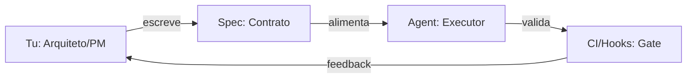
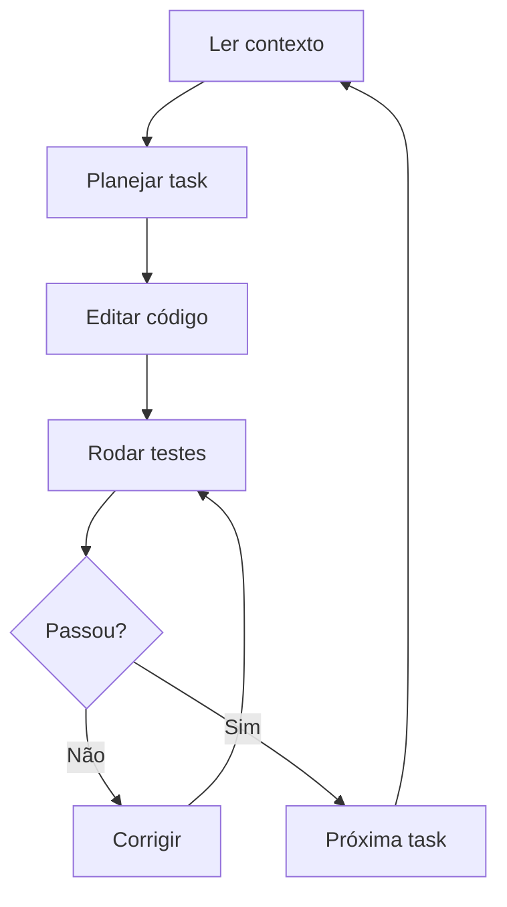
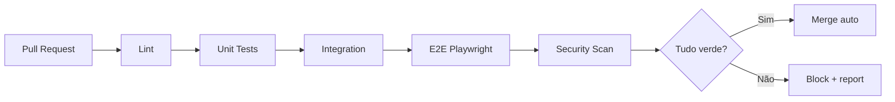
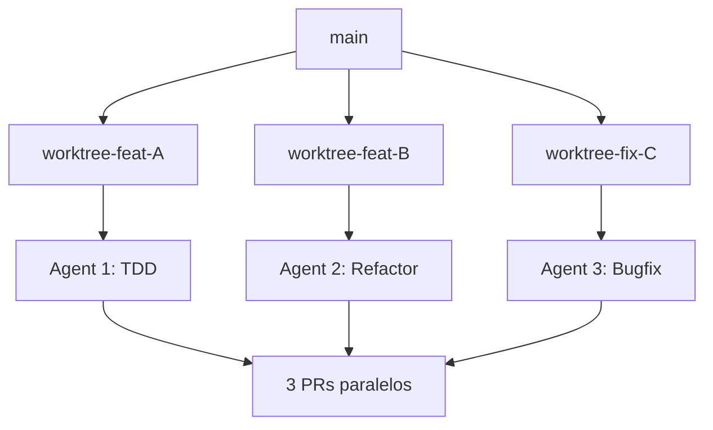

<!-- _class: invert lead -->

# AI Agent Specialist
## Releases Diárias com Agents

**Como entregar com velocidade Anthropic-tier**

Wesley Simplicio · 2026

---

## O Problema

- Dev solo é lento por natureza
- Projetos morrem antes de terminar
- Contexto perdido toda sessão
- Refatoração trava feature
- Bugs voltam porque não há gate
- Documentação envelhece em 2 semanas

> Resultado: 80% das ideias nunca chegam em produção.

---

## A Virada

**Agents + Estrutura = Velocidade Anthropic-tier**

- Tu vira **arquiteto/PM**
- Agents executam edits, testes, reviews
- Specs viram **contrato vinculante**
- Hooks rodam validação a cada save
- CI fecha gate (DoD) antes do merge

> 1 dev + 5 agents paralelos = squad de 6.

---

## Mental Model



- **Tu** define o "o quê" e "porquê"
- **Spec** trava o "como" (DoD, boundaries)
- **Agent** entrega o "quando" (código + teste)

---

## O Loop Universal



Todo agent decente segue esse ciclo. Diferença está na qualidade do **input** (spec) e **output** (gate).

---

## Stack de Instruction Files

| Arquivo | Ferramenta | Escopo |
|---|---|---|
| `AGENTS.md` | Codex CLI | Geral, raiz |
| `CLAUDE.md` | Claude Code | Geral, raiz |
| `.github/copilot-instructions.md` | GitHub Copilot | Workspace |
| `.cursor/rules` | Cursor | Workspace |
| `.codex/config.toml` | Codex sandbox | Aprovações |

> Mesmo conteúdo, ferramentas diferentes. Mantém **uma fonte de verdade** e simlinka.

---

## Anatomia do AGENTS.md

Sections obrigatórias:

- **Mission** — por que o repo existe (1 frase)
- **Stack** — linguagem, framework, libs principais
- **Conventions** — naming, estrutura, idioma de docs
- **Workflow** — branch, PR, deploy
- **Definition of Done** — gate verde antes de merge
- **Don'ts** — o que NUNCA fazer
- **Refs** — links pra `.specs/` (DESIGN, ADRs, BACKLOG)

---

## Specs como Código

```text
.specs/
├── product/
│   ├── VISION.md       # por que existe
│   ├── DOMAIN.md       # entidades, glossário
│   └── PERSONAS.md     # quem usa
├── architecture/
│   ├── DESIGN.md       # diagrama + boundaries
│   ├── PATTERNS.md     # como escrever aqui
│   └── ADR-*.md        # decisões arquiteturais
├── workflow/
│   └── WORKFLOW.md     # branch, PR, deploy
└── sprints/
    ├── BACKLOG.md
    └── sprint-NN/*.task.md
```

Specs viajam com o código. Agents leem antes de editar.

---

## ADRs — Memória de Longo Prazo

```markdown
# ADR-001: Usar Postgres ao invés de DynamoDB

Status: Accepted
Date: 2026-04-15

## Context
Precisamos de joins complexos entre orders e payments.
DynamoDB força denormalização ou scan caro.

## Decision
Postgres 16 com schema relacional.

## Consequences
+ Joins nativos, queries SQL
- Operação extra (RDS vs DynamoDB managed)
```

> Sem ADR: 6 meses depois ninguém lembra **por que** Postgres. Refactor "óbvio" pra DynamoDB destrói a base.

---

## Tasks Atômicas

Template de task:

- **Goal** — 1 frase, escopo cirúrgico
- **Context** — links pra DESIGN, ADR relevante
- **Files** — quais arquivos vão mudar (whitelist)
- **DoD** — testes que precisam passar
- **Out of scope** — o que NÃO fazer
- **Estimate** — small/medium/large

> Task que cabe em 1 PR < 200 linhas. Maior que isso = quebrar em N tasks.

---

## DoD com Gate Automático



CI roda em < 5min. PR fica vermelho → não merge. Sem exceção, sem "depois eu arrumo".

---

## Skills — Capacidades Reutilizáveis

```markdown
# SKILL: playwright-e2e

## When to use
Qualquer task que toque UI ou fluxo web.

## Procedure
1. Ler `playwright.config.ts`
2. Identificar cenários: happy + erros + auth
3. Escrever teste em `tests/e2e/<feature>.spec.ts`
4. Rodar `npx playwright test --headed`
5. Screenshot de cada estado final

## Artifacts
- Screenshots em `test-results/`
- HTML report em `playwright-report/`
```

Skill = receita testada. Agent invoca em vez de improvisar.

---

## Hooks — Automação no Ciclo

| Hook | Quando dispara | O que faz |
|---|---|---|
| `post-edit` | Após Edit/Write | Lint + format auto |
| `pre-commit` | Antes de commit | Bloqueia se teste falhar |
| `pre-push` | Antes de push | Roda type-check |
| `session-start` | Início da sessão | Lê AGENTS.md + status |
| `notification` | Espera input | Bipa terminal |

> Hook não pede permissão. Roda sempre. Garante invariante.

---

## Custom Agents

| Agent | Quando invocar | Output |
|---|---|---|
| `tdd.agent` | Feature nova | Teste primeiro, código depois |
| `reviewer.agent` | Pós-edit | Lista issues + sugestões |
| `architect.agent` | Refactor amplo | DESIGN.md + ADR |
| `security.agent` | Toca auth/input | Scan + checklist OWASP |
| `e2e.agent` | UI alterada | Suite Playwright completa |

Cada agent = arquivo `.md` com prompt + role + tools permitidas.

---

## Worktrees Paralelos



`git worktree add ../proj-feat-A feat/A` → 3-5 agents trabalhando simultâneo, sem conflito de branch.

---

## Playwright + Evidências

Config essencial:

- `trace: 'on-first-retry'` — replay de falhas
- `screenshot: 'only-on-failure'` — print do bug
- `video: 'retain-on-failure'` — gravação
- `reporter: ['html', 'list']` — relatório navegável
- `projects: [chromium, mobile]` — multi-device

Fluxo: agente roda → falha → trace gerado → analisa → corrige → re-roda.

---

## Fluxo Diário

| Manhã | Tarde | Noite |
|---|---|---|
| Standup com agent | Implementação paralela | Review final |
| Triagem backlog | 3-5 worktrees ativos | Merge fila verde |
| Definir top-3 tasks | Hooks rodando | Update CHANGELOG |
| Sprint sync | Playwright suite | Push deploy |
| Café | Lunch+E2E | Bump versão |

> Manhã planeja. Tarde produz. Noite consolida. Todo dia.

---

## Métricas que Importam

| Métrica | Alvo Specialist | Sinal de problema |
|---|---|---|
| Cycle time (task → merge) | < 4h | > 1 dia |
| PR size (linhas) | < 200 | > 500 |
| Reverts/semana | 0 | 2+ |
| Cobertura E2E happy path | 100% | < 80% |
| Lead time deploy | < 30min | > 2h |
| Incidents/release | 0 | 1+ |

Mede semanalmente. Ajusta loop.

---

## Hábitos de Elite

1. Lê `AGENTS.md` antes de qualquer edit
2. Escreve task antes de codar
3. ADR pra decisão > 1 dia de impacto
4. Teste antes de feature (TDD real)
5. PR < 200 linhas, sempre
6. Hooks ativos em todo repo
7. Worktree pra feature paralela
8. Playwright em qualquer fluxo web
9. CHANGELOG bump + versão a cada PR
10. Review próprio antes de pedir review

---

## Roadmap pra Specialist

| Período | Foco | Entregável |
|---|---|---|
| Semana 1-2 | Setup base | AGENTS.md + .specs/ + hooks em 1 projeto |
| Mês 1 | Fluxo loop | DoD verde, CI < 5min, primeiro deploy auto |
| Mês 2 | Skills + agents | 5 skills + 3 custom agents funcionando |
| Mês 3 | Paralelização | 3 worktrees simultâneos, 1 release/dia |
| Mês 6 | Specialist | Mentor outros, contribui Anthropic skills |

> 90 dias do zero ao specialist. Diário, não maratona.

---

## Pitfalls Comuns

- **Drift composto** — specs envelhecem, agents seguem versão errada
- **Falsos verdes** — testes flakeam, ignora-se o vermelho
- **Context drift** — agente esquece DESIGN entre sessões
- **PR gigante** — 1k linhas, ninguém revisa direito
- **Hook desabilitado** — "só desta vez" vira sempre
- **ADR ausente** — refactor destrói decisão antiga
- **Skill genérica** — vira documento não usado

> Inimigo nº1: a tentação de pular o gate "uma vezinha".

---

<!-- _class: invert lead -->

## Próximo Passo

```bash
git clone agentic-starter meu-projeto
cd meu-projeto
# Customizar <PLACEHOLDERS>
# Primeiro spec: VISION.md
# Primeira task: 01-setup.task.md
# Loop: ler -> planejar -> editar -> testar -> merge
```

**Hoje começa o teu primeiro release diário.**

> Velocidade Anthropic-tier não é talento. É loop.
